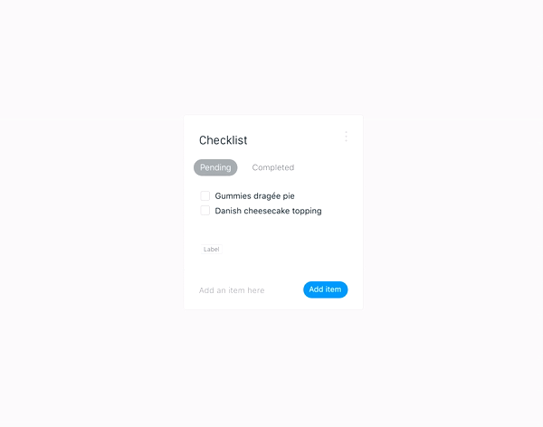

# Recruitment Task

## What is the task?
In order to show your skills and how fast you can learn you'll need to create a "todo" app.

Here's a sample video of a UX:

The closer it will look to this video, the better.

## How to submit a task?
### Using github
1. create a fork of this repository in a github.
1. complete tasks.
1. create a pull request on a github with your changes.

## Where to start?
Before you start coding you should understand main concept of `vue.js` especially its _reactivity_.

If you're not familiar with vue.js 2.0 **start by reading this [guide](https://vuejs.org/v2/guide/)**.

More detailed documentation can be found in [API](https://vuejs.org/v2/api/) section.

## What you should do?
We encourage you to:
 - use [ES6 features](http://es6-features.org/#Constants) in your JavaScript code
 - use [SASS](http://sass-lang.com/documentation/file.SASS_REFERENCE.html) (SCSS) instead of CSS
 - use [CSS flexbox](https://css-tricks.com/snippets/css/a-guide-to-flexbox/)

## What you should not do?
 - add vendor prefixes to your CSS

## What matters most?
Your implementation will be judged based on:
 - understanding of vue.js concepts
 - code structure and readability
 - CSS/SASS markup approach
 - amount of complete tasks
 - your commits
 - your build tools

## FAQ

### Can I use SASS?
Yes, it's highly appreciated!

### Can I use LESS?
We suggest you to use SASS instead of LESS.

You can use it, but you'll need to configure build process to process less properly

### What editor should I use?
You can use any editor you like.
In case you don't have one, you can use [atom](https://atom.io) with [vue.js plugin](https://atom.io/packages/language-vue)

### How to debug vue.js application?
Debugging reactive application can be very tricky, so to help it we suggest to use Google Chrome with [vue-devtools](https://chrome.google.com/webstore/detail/vuejs-devtools/nhdogjmejiglipccpnnnanhbledajbpd?hl=en)

